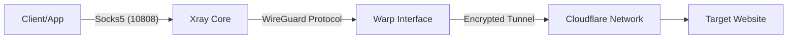

# 🛡️ Docker Xray Warp Gateway

[](https://www.docker.com/)
[](https://github.com/XTLS/Xray-core)
[](https://1.1.1.1/)
[](LICENSE)

> **A generic, self-healing Docker module that bridges Xray traffic through Cloudflare Warp (WireGuard).**
> *Designed for high-availability, anti-censorship, and secure IP masking.*

---

## 📖 Overview
**Docker Xray Warp Gateway** is a plug-and-play solution designed to bypass severe internet restrictions and IP blocking. It automatically provisions a **Cloudflare Warp** interface (using `wgcf`) and routes inbound Socks5/HTTP traffic through it.

Unlike simple VPN containers, this module includes a **Survivor Script** that:
1.  **Auto-Registers** a Warp account (Free or Plus) if missing.
2.  **Fixes MTU** issues (set to 1280) to prevent packet loss.
3.  **Sanitizes Configs** to prevent JSON errors during generation.
4.  **Prioritizes Clean IPs** (Endpoint Routing) to bypass DNS poisoning.

## ✨ Key Features
* 🐳 **Docker Native:** Runs as a standalone container or a submodule ().
* 🔄 **Auto-Provisioning:** No manual key generation needed. Just run and it registers.
* 🛡️ **Privacy First:** Hides your VPS IP behind Cloudflare's massive IP pool.
* ⚡ **High Performance:** Uses Xray Core for minimal latency and high throughput.
* 🧩 **Modular:** Can be easily integrated into Python bots, trading apps, or scraping projects.

---

## 🚀 Installation & Usage

### Method 1: Standalone (Quick Start)
Clone the repository and launch the container. Port `10808` will be exposed locally.

```bash
git clone https://github.com/MeRezaRezaei/docker-xray-warp-gateway.git
cd docker-xray-warp-gateway
docker compose up -d --build
```

**Test Connection:**
```bash
curl -x socks5h://127.0.0.1:10808 https://ifconfig.me
# Output should be a Cloudflare IP, not your server IP.
```

### Method 2: As a Module (Best Practice)
Add this to your existing `docker-compose.yml` to provide proxy access to other containers.

```yaml
include:
  - path: ./docker-xray-warp-gateway/docker-compose.yml
    env_file: ./docker-xray-warp-gateway/.env

services:
  your-app:
    image: python:alpine
    environment:
      - ALL_PROXY=socks5://warp:10808
    depends_on:
      - warp
```

---

## ⚙️ Configuration (.env)

| Variable | Description | Default |
| :--- | :--- | :--- |
| `WARP_LICENSE_KEY` | Your Warp+ Key (Leave empty for a free account) | `""` |
| `WARP_PRIVATE_KEY` | Manual WireGuard Private Key (Skips auto-gen) | `""` |
| `WARP_ADDRESS_V4` | Manual IPv4 Address (Required if manual key used) | `""` |
| `WARP_ADDRESS_V6` | Manual IPv6 Address | `""` |

---

## 🏗️ Architecture



## 🤝 Contributing
Contributions, issues, and feature requests are welcome! Feel free to check the [issues page](https://github.com/MeRezaRezaei/docker-xray-warp-gateway/issues).

## 📝 License
Distributed under the MIT License. See `LICENSE` for more information.
